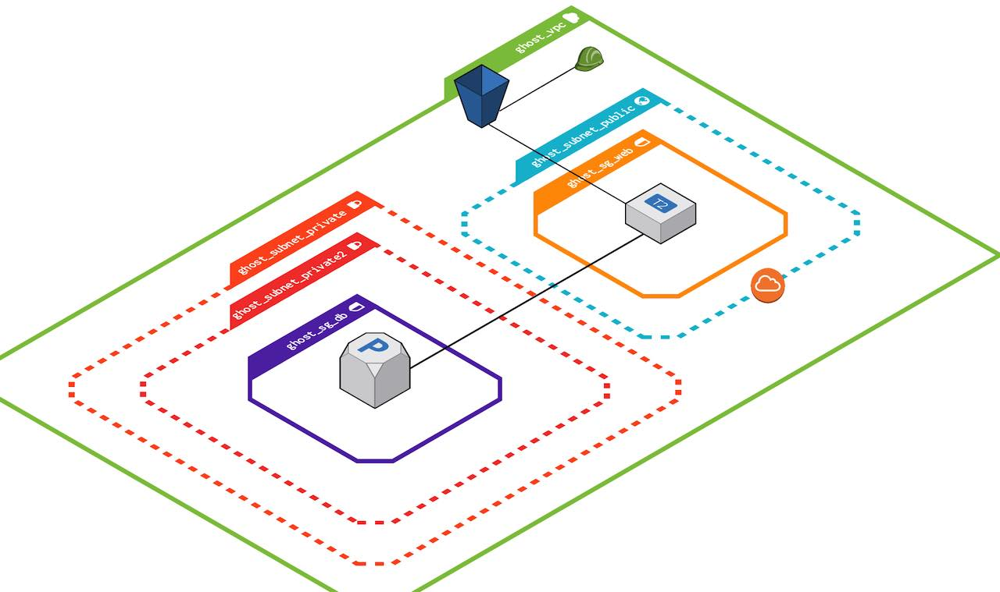

# ghost-docker-terraform

Ghost Blog Site Deployment with Terraform, AWS, and Docker

## Overview

This project provides an automated deployment solution for setting up a Ghost blog site using Terraform, AWS (Amazon Web Services), and Docker. It aims to simplify the process of provisioning the necessary infrastructure and deploying the Ghost blogging platform within a Docker container on AWS.

## Diagram

## Features

- Infrastructure provisioning: Utilize Terraform to automate the creation and configuration of AWS resources required for the Ghost blog site.
- Containerized deployment: Utilize Docker to encapsulate the Ghost blogging platform, enabling easy portability and scalability.
- High availability: Leverage AWS services to ensure high availability and fault tolerance of the blog site.
- Customizability: Easily configure and modify the deployment parameters to fit specific requirements.
- Infrastructure as Code (IaC): Infrastructure setup is defined as code using Terraform, enabling version control and reproducibility.

## Technologies Used

- Terraform: Infrastructure provisioning tool
- AWS: Cloud platform for hosting the infrastructure
- Docker: Containerization platform
- Ghost: Open-source blogging platform

## Getting Started

To deploy the Ghost blog site using this project, follow the instructions below:

- Clone the repository: `git clone https://github.com/tahabozdemir/ghost-docker-terraform`
- Install Terraform.

- Configure your AWS credentials and provide necessary information in the Terraform variables.

- Run the Terraform commands to provision the infrastructure on AWS. `terraform init` and then `terraform apply` .

- Deploy the Ghost blog site in a Docker container using the provided dockerfile and docker-compose.

### `setups_amazon_linux.sh`

This script automates the setup process for an Amazon Linux system by performing the following tasks:

- Updating the system packages.
- Installing Docker, and Docker Compose.
- Creating swap space to optimize system performance and prevent out-of-memory issues.

## License

This project is licensed under the MIT License. See the LICENSE file for more info.
